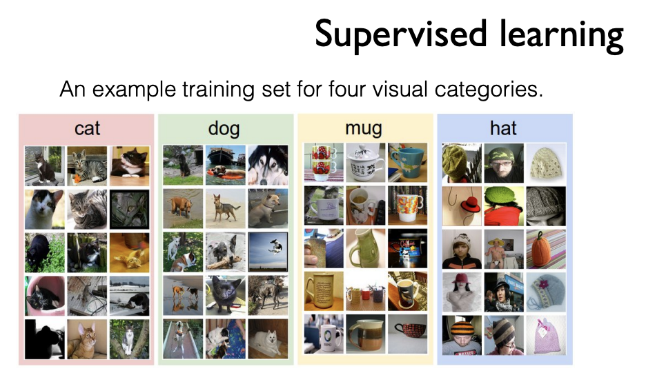

# 1.1. 기본적인 Machine Learning의 용어와 개념 설명

## Basic concepts

What is ML?

What is learning?

* supervised
* unsupervised

What is regression?

What is classification?

## Machine Learning

Limitations of explicit programming

* Spam filter: many rules
* Automatic driving: too many rules

Machine learning: "Field of study that gives computers the ability to learn without being explicitly programmed” Arthur Samuel \(1959\)

## Supervised/Unsupervised learning

### Supervised learning:

* learning with labeled examples - training set
* Most common problem type in ML
  * Image labeling: learning from tagged images
  * Email spam filter: learning from labeled \(spam or ham\)

    email

  * Predicting exam score: learning from previous exam

    score and time spent

#### Training data set

### Unsupervised learning: un-labeled data

* Google news grouping
* Word clustering 

## Typess of Supervised Learning

Predicting final exam score based on time spent

* **regression**

Pass/non-pass based on time spent

* **binary classification**

Letter grade \(A, B, C, E and F\) based on time spent

* **multi-label classification**

### Predicting final exam score based on time spent

### Pass/non-pass based on time spent

### Letter grade \(A, B, ...\) based on time spent

###  

